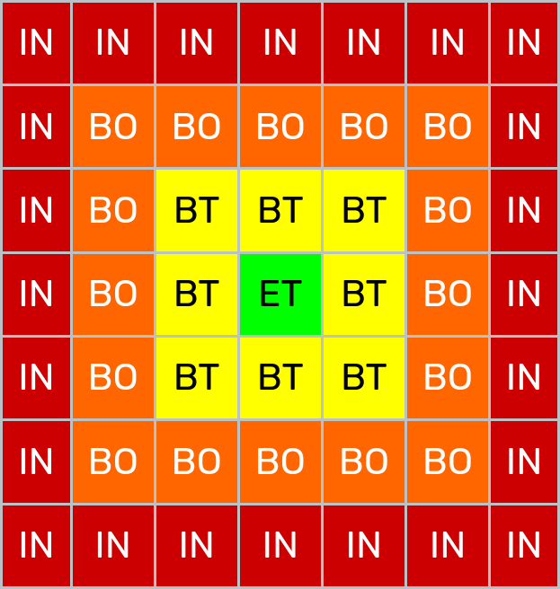

**extgfa** is a proof-of-concept implementation for an external-memory [GFA](https://gfa-spec.github.io/GFA-spec/GFA1.html)
representation. This implementation provides both
some sort of index, and a graph class that uses the index created to only load smaller parts of the graph and not load the complete graph
in memory.
This is especially useful when the user only want to look at or extract a small part of the graph. The user does not
need to care about how internally the class deals with loading and unloading parts of the graph, this is done seemliness behind the scenes.

- [Idea](#idea)
- [Graph Partitioning](#graph-partitioning)
- [Graph Class](#graph-class)
- [Usage and Examples](#usage-and-examples)
    + [HPRC Minigraph Chr22 Example](#hprc-minigraph-chr22-example)
    + [Working with Graph Classes](#working-with-graph-classes)
      + [Example Algorithm using ChGraph Class](#example-algorithm-using-chgraph-class)

# Idea
The idea here is inspired by [Minecraft](https://minecraft.fandom.com/wiki/Minecraft_Wiki).
Where in Minecraft, the map is cut into [chunks](https://minecraft.fandom.com/wiki/Chunk)
of 16 by 16 blocks, and chunks are stored
on disk; only chunks that are close to the player's location are loaded into memory.
When the player moves in a certain direction, further
away chunks are unloaded, and closer chunks loaded.

Looking at the figure below, the block or chunk in green is where the chunk and all its aspects are completely loaded into memory.
The chunks in red that are furthest from the player in the middle are the chunks that are unloaded yet. For Minecraft, they also
have two types of chunk-loading levels, here in yellow and orange, where some aspects of the chunks are loaded and some are not, e.g.
textures are loaded, but animals are not for example.

<p align="center">
    
</p>

In genome graph world, one of the current problems with processing big graphs in the GFA format is that we need to read
the complete file and libraries that use GFAs tend to load the complete graph in memory.
While depending on what the application is, this might not be necessary.
For example, if the user would like to only look at or investigate a small part of the graph,
or just few nodes, the user still needs to read the complete GFA file
and load the complete graph in memory, which can be quite resources heavy.

Following the logic of Minecraft, we investigated whether a similar mechanism can be used for genome graphs in GFA format.
In other words, we split the graph into smaller connected neighborhoods (chunks), and store those in a way that we can retrieve
only the chunk when needed and not load the complete graph. In the following section we explain how we achieved that.


# Graph Partitioning
First, we need to partition the graph into smaller neighborhoods or chunks, then store these chunks in a way that we can
easily retrieve them from disk.
In order to do that, we developed two steps: cutting the graph into chunks and outputting a reordered GFA with indexes.

There are many graph algorithms that cut the graph into smaller parts, or find connected neighborhoods. We tested three
algorithms implemented in the `NetworkX` library, the Kernighan-Lin algorithm, Louvian communities,
and Clauset-Newman-Moore greedy modularity maximization algorithm.

At the moment, the user can choose between Kernighan-Lin, Louvian communities, or Clauset-Newman-Moore algorithm for partitioning
the graph into chunks. However, after testing a couple of graphs, we found that Kernighan-Lin doesn't work as well as the other two.

The user can also specify a top and bottom thresholds: (1) Top threshold is the maximum number of nodes of a chunk, i.e. if a chunk
has more nodes than the top threshold, this chunk will be split further using the chosen algorithm. (2) Bottom threshold 
is the minimum number of nodes of a chunk, i.e. if a chunk has fewer nodes than the bottom threshold, this chunk
will be merged with a neighboring chunk if available.

Once the graph is partitioned into chunk, each chunk is assigned an ID arbitrarily from 0 to _N_ where _N_ is the number of chunks.
We then produce 3 files:

1. Reordered GFA file: **extgfa** produces a new GFA that is similar to the input GFA file.
However, the S and L lines are ordered in such a way, that the nodes and edges that belong to one chunk are written consecutively in the GFA file.
We also keep track of the output file offset where that chunk started in the output GFA file and the number of lines for that chunk.
Therefore, this allows us to retrieve a chunk from the reordered GFA file without having to read the complete file, and we only need
to jump to the specific file offset and read the specific number of lines associated with the chunk.
2. Chunk offset index: Simply, this is a `pickled` dictionary where the key is the integer chunk ID, and the value is tuple of
two values, the first is the offset number in the reordered GFA output and the second is the number of lines to read starting from that offset.
3. `dbm` file written using `shelve`: A key-value external database where the key is the node ID and the value is the chunk ID.
This database is not loaded into memory and can be used to figure out which chunk ID to load when encountering a node that is not loaded yet.

Therefore, **extgfa** takes a GFA graph as an input and produces three files: reordered GFA, pickled index, `dbm` database.


<p align="center">
    
</p>

# Installation
**extgfa** is a simple python package and can be installed with `python3 setup.py install` or from the package directory running
`pip install .`.

Once installed, it can be used a command line tool for creating the chunked graph,
or the user can simply import `from extgfa.Graph import Graph` or `from extgfa.ChGraph import ChGraph`, 
import and use the graph classes implemented.

# Graph Class
Two GFA graph classes are implemented in **extgfa**, both can be imported and used in your own scripts. One is called `extgfa.Graph`,
this class loads the complete GFA graph and can be given any GFA file. The second one is called `extgfa.ChGraph`, and is used for
the chunked graphs, this class requires the reordered GFA file and the index files along with it.

Both classes implement the same functionalities and internally handle whether the complete graph is loaded or not,
the user does not have to manage any memory themselves.

For examples on how to use these classes, please take a look at the next section.

# Usage and Examples
To generate the index for a GFA file, **extgfa** can be simply called from the command line after installation.
First, you need to choose which algorithm to use for chunking, there are 3 options
1. `lv` for Louvian communities Algorithm
2. `gm` for Clauset-Newman-Moore Algorithm
3. `kl` for Kernighal-Lin algorithm

Then you need to give the input GFA file, the name of the output GFA file and the upper and lower thresholds.
The thresholds are integer.

## HPRC Minigraph Chr22 Example
The example uses the graph in the example directory in this repo. This graph represent Chr22 from the 
[HPRC minigraph](https://github.com/human-pangenomics/hpp_pangenome_resources).

```
$ extgfa gm chm13-90c-chr22.gfa chm13-90c-chr22-chunked_gm.gfa 300 30
```
This means that **extgfa** will run `gm` algorithm on the input graph and a chunk can be at most 300 nodes big,
and minimum 30 nodes, if less than 30 nodes, it will be merged with neighboring chunks if possible,
if bigger than 300 nodes, it will be split further.

This will produce 4 files:
1. `chm13-90c-chr22-chunked_gm.csv` which is a [Bandage](https://rrwick.github.io/Bandage/) compatible CSV file with colors for the different chunks for visualization
2. `chm13-90c-chr22-chunked_gm.db` which is the node_id:chunk_id database
3. `chm13-90c-chr22-chunked_gm.index` which is the pickled chunk_id:(offset, n_lines)
4. `chm13-90c-chr22-chunked_gm.gfa` is the new reordered GFA file

Users can now use the `ChGraph` class to work with this indexed graph in low memory.
For example, let's say we want to extract a small subgraph around a given node, we can use
the already-implemented BFS function with a start node,
and output this subgraph as a separate GFA file; the following code shows this:

```python
from extgfa.ChGraph import ChGraph

graph = ChGraph("chm13-90c-chr22-chunked_gm.gfa")
# if we check the length of the graph, we see it's 0, no nodes have been loaded yet
print(len(graph))
# 0

# now we want to extract a neighborhood of 50 nodes around the node s594053
# we can use the bfs function implemented in the graph class
# which returns a set of node IDs that represent this neighborhood
# even though the graph is empty, internally it will automatically load the necessary chunks
subgraph = graph.bfs("s594053", 50)

# to output this subgraph into a new GFA, you can call write_graph method and give the set
# of nodes and an output file name
graph.write_gfa(set_of_nodes=subgraph, output_file="test_subgraph.gfa", append=False)
# You can use append=True to append to an already existing output GFA file

# Note: this works exactly the same if you use Graph class instead of ChGraph
# both have the same functionalities and named the same
```

**PLEASE NOTE** that once the reordered GFA and indexes are generated, these shouldn't be
manually manipulated, so basically when you use the `ChGraph` class and manipulate the graph,
e.g. remove edges, nodes, sequences, etc. You need to output a new GFA.

## Working with Graph Classes
Here, I will show a couple of internal functionalities that these classes have in case the user
wants to write their own graph algorithms for their own needs.

```python
from extgfa.ChGraph import ChGraph

graph = ChGraph("chm13-90c-chr22-chunked_gm.gfa")

# You can get the chunk ID from a node ID that is not yet loaded like this
# node ids are always strings
chunk_id = graph.get_node_chunk("s287613")

# user can manually load a certain chunk if needed
graph.load_chunk(chunk_id)

# There is a limit to how many chunks are kept before older chunks are removed
# this limit is by default is 10
# The user can change this if they want, increasing this number will increase the number
# of chunks allowed in memory, hence, increasing the memory requirements but can make some
# algorithms that rely on accessing many nodes faster
print(graph.loaded_c_limit)
graph.loaded_c_limit = 20

# you can see how many chunks loaded with
len(graph.loaded_c)

# if the user want to see the neighbors of a node, simply can use this
neighbors = graph.neighbors("s287613")
# neighbors here is a list of node IDs of the nodes that have an edge with this node
# this also automatically loads the chunks needed if the neighbors of this node are not loaded yet


# Because GFAs are bidirected graphs, you can access nodes from one direction
# i.e. connected to start or connected to end of the current node, and the edge set returned
# is a set of tuples, where each tuple has 3 values (node_id, direction, overlap)
# direction is 0 for ("to start" edge) or 1 for ("to end" edge)
# for example
from_start_edges = graph["s287613"].start
# {('s287612', 1, 0), ('s577859', 0, 0)}
# so our node s287613 is connected to s287612 with (from_start to to_end edge)
# and connected to s577859 with (from_start to to_start edge)
from_end_edges = graph["s287613"].end
# {('s287614', 0, 0), ('s650547', 0, 0)}
# s287613 connected to s287614 with (from_end to to_start edge)
# and to s650547 also with (from_end to to_start edge)
# all these edges have overlap of 0
```

### Example Algorithm using ChGraph Class
As an extra example, let's say the user wants to implement DFS (Depth-First-Search) using the
chunked graph class, the following code shows that:

```python
from extgfa.ChGraph import ChGraph

def dfs(graph, start, cutoff):
    visited = set()
    stack = [start]
    while stack:
        node = stack.pop()
        if node not in visited:
            visited.add(node)
            if len(visited) > cutoff:
              return visited

            for neighbor in graph.neighbors(node):
                if neighbor not in visited:
                    stack.append(neighbor)
    return visited

# we load the chunked graph
graph = ChGraph("chm13-90c-chr22-chunked_gm.gfa")

# graph here will be empty, and when we call the dfs algorithm
# the class automatically load any needed chunks without the user's intervention
dfs_list = dfs(graph, "s578029", 100)

```